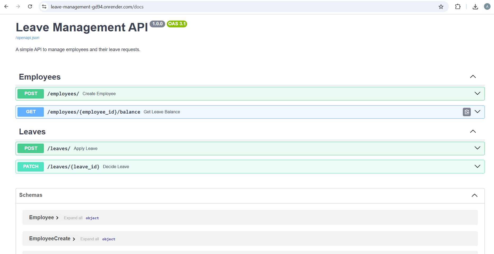
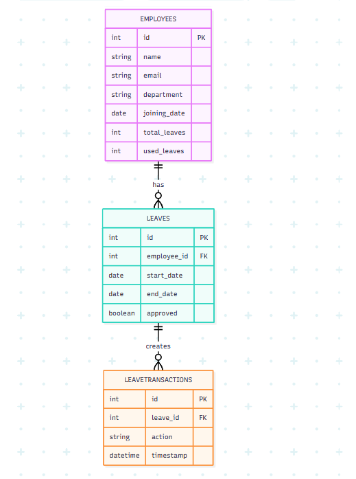

# Leave Management System

## Setup

1. Install dependencies:
   ```
   pip install -r requirements.txt
   ```
2. Run the server:
   ```
   uvicorn app.main:app --reload
   ```
3. Open [http://127.0.0.1:8000/docs](http://127.0.0.1:8000/docs) to use the API.

## API Endpoints

- **POST /employees/** — Add a new employee
- **POST /leaves/** — Apply for leave
- **PATCH /leaves/{leave_id}** — Approve/Reject leave
- **GET /employees/{employee_id}/balance** — Get leave balance

## Assumptions

- Each employee starts with 20 leave days.
- Only HR can approve/reject leaves.

## Edge Cases Handled

- Leave before joining date
- Overlapping leaves
- Leave > balance
- Invalid dates
- Employee not found
- Duplicate email
- Approving already processed leave

## Potential Improvements

- Authentication
- Employee self-service
- Email notifications
- Pagination

## High Level System Design

 <!-- Add your architecture diagram here -->

### API and Database Interaction

- User sends HTTP requests to FastAPI endpoints.
- FastAPI validates and processes requests, calling CRUD logic.
- CRUD logic uses SQLAlchemy to interact with the database.
- Database stores and retrieves employee and leave data.
- FastAPI returns responses to the user.

### Scaling Plan

- Move from SQLite to PostgreSQL/MySQL for more users.
- Use production WSGI/ASGI servers (Gunicorn/Uvicorn).
- Add connection pooling and caching.
- Deploy on scalable cloud platforms.


## Sample Input/Output

### 1. Add Employee

**Request:**
```json
POST /employees/
{
  "name": "string",
  "email": "user@example.com",
  "department": "string",
  "joining_date": "2025-08-12"
}
```
**Response:**
```json
{
  "id": 1,
  "name": "string",
  "email": "user@example.com",
  "department": "string",
  "joining_date": "2025-08-12",
  "total_leaves": 20,
  "used_leaves": 0
}
```

### 2. Apply for Leave

**Request:**
```json
POST /leaves/
{
  "employee_id": 1,
  "start_date": "2025-08-15",
  "end_date": "2025-08-17"
}
```
**Response:**
```json
{
  "id": 1,
  "start_date": "2025-08-15",
  "end_date": "2025-08-17",
  "approved": null,
  "employee_id": 1
}
```

### 3. Approve Leave

**Request:**
```json
PATCH /leaves/1
{
  "approved": true
}
```
**Response:**
```json
{
  "id": 1,
  "start_date": "2025-08-15",
  "end_date": "2025-08-17",
  "approved": true,
  "employee_id": 1
}
```

### 4. Get Leave Balance

**Request:**
```
GET /employees/1/balance
```
**Response:**
```json
{
  "employee_id": 1,
  "leave_balance": 17
}
```
## API Documentation Screenshot



# Leave Management System

**Live Demo:** [https://leave-management-gd94.onrender.com/docs](https://leave-management-gd94.onrender.com/docs)

#Part 1 — Data Modelling
#Create a basic ER diagram for the system.
#Define database tables for employees, leaves, and leave transactions.
#Specify keys, relationships, and indexes.
## ER Diagram



## Database Schema

The project uses the following schema:

- **Employees**: Stores employee details and leave balances.
- **Leaves**: Stores leave requests linked to employees.
- **Leave Transactions**: Stores the history of leave request actions.

You can find the full schema definition here: [schema.sql](schema.sql)

# Part 2 — Low Level System Design

---

## 1. API Contracts (Request/Response Format)

1. API Contracts (Request/Response Format)
1.1 Add Employee

Request

POST /employees/
{
  "name": "string",
  "email": "user@example.com",
  "department": "string",
  "joining_date": "2025-08-12"
}